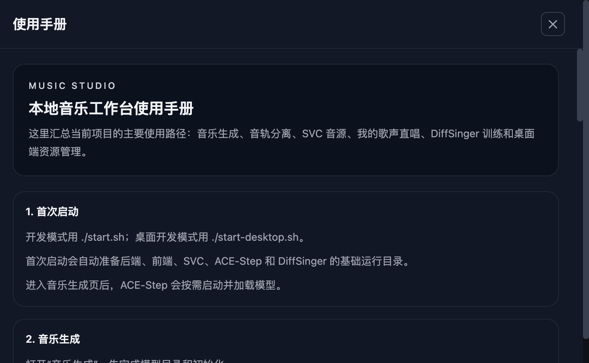

# Music Studio 用户使用手册

本文面向使用者，说明如何启动项目、使用音乐生成、音轨分离和 SVC 音源。

## 1. 启动项目

### 浏览器开发模式

```bash
./start.sh
```

启动后打开：

```text
http://localhost:5173
```

`start.sh` 会启动后端、Celery worker、前端和 SVC sidecar。ACE-Step 会在进入“音乐生成”页后按需启动。

### 桌面开发模式

```bash
./start-desktop.sh
```

桌面端会由 Tauri 拉起前端和后端，并在顶部显示下载中心、资源占用和设置入口。

## 2. 顶部导航



- `音乐生成`：使用 ACE-Step 生成音乐。
- `音轨分离`：把歌曲拆成主唱、鼓、贝斯、钢琴等音轨。
- `SVC 音源`：管理人声转换音源。
- `? 手册`：打开内置使用手册。
- `⚙ 设置`：配置工作目录、模型目录、日志、SVC 音源目录和生成参数。

## 3. 音乐生成

1. 打开 `音乐生成`。
2. 首次使用时先选择模型和目录。
3. 保存后启动 ACE-Step sidecar。
4. 等待模型下载和初始化完成。
5. 填写风格描述、歌词、时长等参数。
6. 点击生成。

生成结果会进入历史歌曲列表。每首历史歌曲可以：

- 播放
- 下载
- 查看参数
- 发送到“音轨分离”
- 开启人声模式后转成指定 SVC 音色

## 4. 音轨分离

1. 打开 `音轨分离`。
2. 上传音频文件。
3. 选择需要分离的 stem。
4. 点击开始分离。

完成后可以试听、下载单轨，或者打包下载全部。

## 5. SVC 音源

SVC 用于“把已有人声转换成你的音色”。它不是从零唱歌，而是转声线。

推荐流程：

1. 打开 `⚙ 设置`。
2. 配置 SVC 音源目录。
3. 打开 `SVC 音源`。
4. 导入或训练音源。
5. 在 `音乐生成` 里开启人声模式并选择音源。

## 6. 日志与排查

每次启动会创建：

```text
logs/runs/YYYYMMDD_HHMMSS/
```

常见日志：

- `launcher.log`
- `api.log`
- `worker.log`
- `acestep.log`
- `svc.log`

可以在 `⚙ 设置 -> 运行日志` 中查看。

## 7. 常见问题

### 音乐生成无法开始怎么办？

先在 `⚙ 设置` 里配置模型目录并完成初始化，再回到 `音乐生成` 提交任务。

### 人声模式无法使用怎么办？

人声模式依赖 SVC 音源服务，请先在 `SVC 音源` 里导入或训练出可用音色，并确认 SVC 服务已启动。

### 为什么本地处理很慢？

本地 CPU 或 Apple MPS 处理会比较慢。建议先用小数据验证流程，重负载放到 Linux + NVIDIA GPU。
